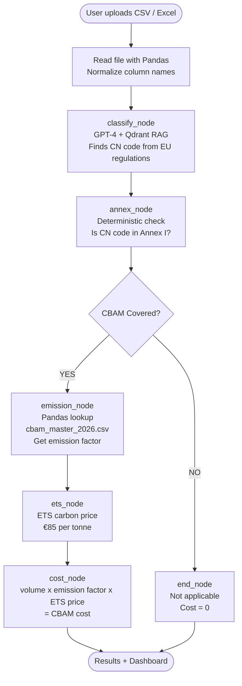

# CBAM Pilot AI 🌍

> AI-powered EU Carbon Border Adjustment Mechanism compliance engine.
> Upload your import file → Get CBAM coverage + carbon cost estimate in seconds.

---

## What is this project?

When a company imports goods like **steel, aluminium, or cement** into the EU,
they may need to pay a **carbon tax** called CBAM (Carbon Border Adjustment Mechanism).

This system automates that process:

1. You upload a CSV or Excel file with your import data
2. AI classifies each product and finds its CN code
3. System checks if it falls under EU CBAM regulation (Annex I)
4. If yes → calculates the carbon cost using EU default emission values
5. Shows you a compliance dashboard with total cost and risk level

---

## Live Demo

🔗 **Frontend:** https://your-frontend-url.com  
🔗 **API Docs:** https://your-backend-url.com/docs

---

## Pipeline Flow



---

## Key Design Decisions

| Decision                  | Why                                                                          |
| ------------------------- | ---------------------------------------------------------------------------- |
| RAG for PDFs              | EU regulation PDFs need semantic search — AI reads actual law                |
| Pandas for CSV/Excel      | Structured data needs exact lookup — faster and more reliable than AI        |
| LangGraph pipeline        | Fixed compliance steps with conditional routing — stops early if not covered |
| LLM only in classify_node | AI only where needed — annex check and cost math are deterministic           |
| Qdrant Cloud              | Cloud vector DB — accessible from AWS deployment                             |

---

## Sample Input

```csv
product_description,country_of_origin,volume_tonnes,supplier
Hot rolled steel coils,India,500,Steel Corp
Portland cement,China,120,Cement Ltd
Aluminium ingots,Russia,30,Rusal
Smartphones,China,50,Tech Corp
```

## Sample Output

| Product                | CN Code | CBAM Covered | Est. Cost |
| ---------------------- | ------- | ------------ | --------- |
| Hot rolled steel coils | 7225    | ✅ Yes       | €93,925   |
| Portland cement        | 2523    | ✅ Yes       | €8,690    |
| Aluminium ingots       | 7601    | ✅ Yes       | €26,775   |
| Smartphones            | 8517    | ❌ No        | —         |

---

## Project Structure

```
backend/
├── data/
│   ├── CBAM Regulation.pdf          ← RAG source
│   ├── CN-code.pdf                  ← RAG source
│   ├── COMMISSION IMPLEMENTING REGULATION 2026.pdf  ← RAG source
│   ├── Default emission values.pdf  ← RAG source
│   ├── cbam_master_2026.csv         ← Pandas lookup (EU emission values)
│   └── hs_code.csv                  ← Pandas lookup (HS code validation)
│
├── graph/
│   ├── state.py        ← CBAMState TypedDict (shared data bag)
│   ├── nodes.py        ← All 6 pipeline nodes
│   └── pipeline.py     ← LangGraph wiring (nodes + edges)
│
├── rag/
│   ├── ingest.py       ← Load PDFs → chunks → Qdrant points (run once)
│   └── query.py        ← Search Qdrant → return relevant regulation text
│
├── services/
│   ├── annex.py        ← Annex I CN code list + coverage check
│   ├── emissions.py    ← Emission factor lookup from EU CSV
│   ├── ets.py          ← ETS carbon price (static MVP)
│   ├── cost_engine.py  ← Cost calculation math
│   └── hs_lookup.py    ← HS code pandas validation
│
├── api/
│   └── main.py         ← FastAPI endpoint POST /analyze
│
└── models/
    └── schemas.py      ← Flexible input schema (accepts any CSV format)

frontend/
├── src/
│   ├── App.jsx                  ← 4-step flow controller
│   ├── components/
│   │   ├── UploadForm.jsx       ← File upload UI
│   │   ├── ClassificationResult.jsx  ← Results table
│   │   └── Dashboard.jsx        ← CBAM dashboard
```

---

## Tech Stack

| Layer           | Technology                    |
| --------------- | ----------------------------- |
| AI Pipeline     | LangGraph + LangChain         |
| LLM             | OpenAI GPT-4o-mini            |
| Vector DB       | Qdrant Cloud                  |
| Embeddings      | OpenAI text-embedding-3-small |
| Structured Data | Pandas                        |
| Backend         | FastAPI (Python)              |
| Frontend        | React + TailwindCSS           |
| Deployment      | AWS EC2 + S3                  |
| Monitoring      | LangSmith                     |

---

## How to Run Locally

### Backend

```bash
cd backend
python -m venv .venv
.venv\Scripts\activate        # Windows
pip install -r requirements.txt

# Add your keys to .env
OPENAI_API_KEY=your_key
QDRANT_URL=your_qdrant_cloud_url
QDRANT_API_KEY=your_qdrant_api_key

# Run RAG ingestion once
python -m rag.ingest

# Start API
uvicorn api.main:app --reload
```

### Frontend

```bash
cd frontend
npm install

# Add to .env
VITE_API_URL=http://localhost:8000

npm run dev
```

---

## What is ETS? (Simple Explanation)

ETS = EU Emissions Trading System = Carbon Price

- Every tonne of CO2 released costs money
- Companies buy carbon certificates to cover their emissions
- Current price ≈ **€85 per tonne of CO2**
- CBAM cost = `volume × emission_factor × ETS_price`

Example:

```
500 tonnes of steel × 2.21 tCO2/tonne × €85 = €93,925
```

---

## Data Sources

| File                           | Source                      | Used For                     |
| ------------------------------ | --------------------------- | ---------------------------- |
| CBAM Regulation.pdf            | EU Regulation (EU) 2023/956 | RAG — scope and legal rules  |
| CN-code.pdf                    | EU Combined Nomenclature    | RAG — product classification |
| Commission Regulation 2026.pdf | EU Commission               | RAG — technical rules        |
| Default emission values.pdf    | EU Commission               | RAG — emission methodology   |
| cbam_master_2026.csv           | EU Commission               | Pandas — emission factors    |
| hs_code.csv                    | EU Tariff Database          | Pandas — HS code validation  |

---

## Built By

**Avinash Palakurthi** — Applied AI Engineer  
Specializing in EU Regulatory Automation (CBAM, ADR, ICS2)

🔗 LinkedIn: www.linkedin.com/in/avinashpalakurthi0721  
📧 Email: Palakurthiavinash07@gmail.com
